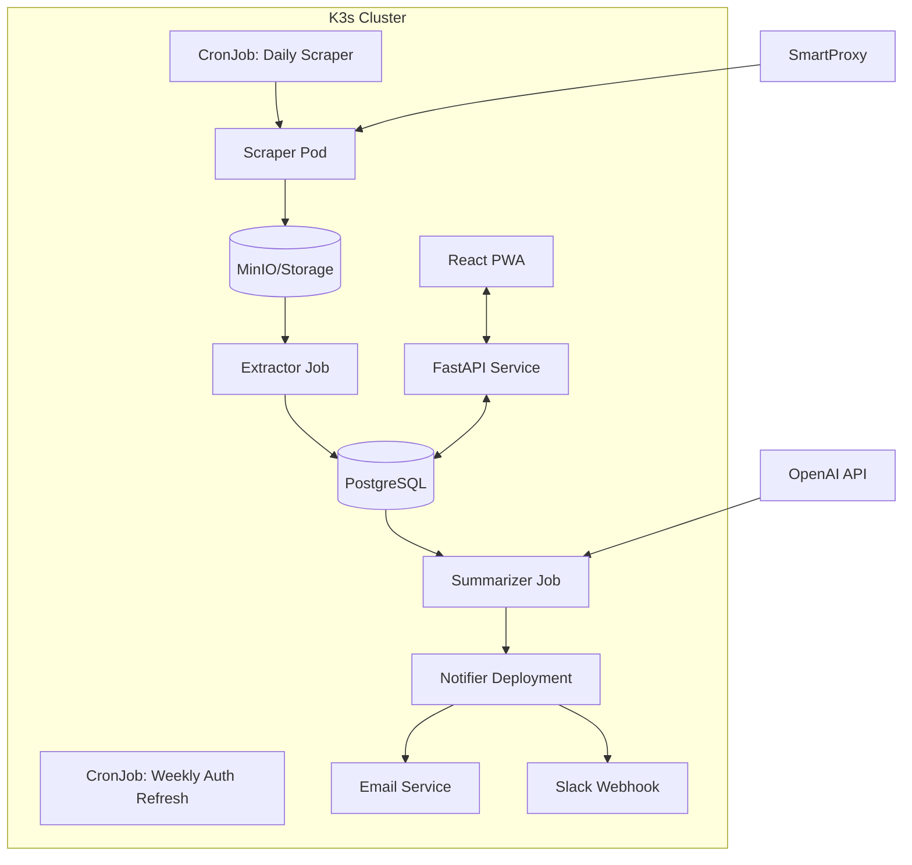

# News Analyzer Implementation Plan

## Project Overview
Building an automated system to scrape, extract, summarize, and deliver content from Southwest Virginia Today's e-edition, using SmartProxy for reliable access and deploying to a K3s cluster.

## Architecture Overview



## Phase 1: Enhanced Scraper with Proxy Support (Day 1)

### 1.1 Update Configuration
- Add SmartProxy settings to `scraper/config.py`
- Include proxy rotation logic
- Add K8s-specific environment variables

### 1.2 Enhance Login Script
- Integrate proxy support into Playwright
- Add retry logic with proxy rotation
- Store auth tokens in K8s secrets

### 1.3 Edition Discovery
- Create `scraper/discover.py` to find available editions
- Support both PDF and HTML formats
- Generate URLs for all pages/sections

### 1.4 Download & Cache System
- Implement `scraper/downloader.py` with proxy support
- Use MinIO for distributed storage in K8s
- Add idempotent download logic

## Phase 2: Text Extraction Pipeline (Day 2)

### 2.1 PDF Extraction
- Use pdfminer-six for PDF text extraction
- Implement page segmentation logic
- Handle multi-column layouts

### 2.2 HTML Extraction
- Use trafilatura for clean text extraction
- Preserve article metadata (title, date, section)
- Handle dynamic content loading

### 2.3 Deduplication System
- PostgreSQL schema for article storage
- Hash-based duplicate detection
- Track processing history

## Phase 3: AI Summarization Service (Day 3)

### 3.1 FastAPI Service
- Create `summarizer/api.py` with endpoints
- Implement prompt templates for local news
- Add token usage tracking

### 3.2 Batch Processing
- Queue-based architecture for scalability
- Rate limiting for OpenAI API
- Error handling and retries

### 3.3 Summary Storage
- Store summaries in PostgreSQL
- Link to original articles
- Track generation metadata

## Phase 4: Notification System (Day 4)

### 4.1 Multi-Channel Support
- Email digests via SendGrid/SES
- Slack webhooks for instant updates
- Optional: Push notifications

### 4.2 Subscription Management
- User preferences in PostgreSQL
- Keyword/section filtering
- Delivery schedules

## Phase 5: Kubernetes Deployment (Day 5)

### 5.1 Container Images
- Multi-stage Dockerfiles
- Private registry at harbor.lan
- Multi-arch builds (amd64/arm64)

### 5.2 K8s Manifests
- CronJobs for scraper (daily) and auth refresh (weekly)
- Jobs for extraction and summarization
- Deployments for API and notifier
- Services and Ingress for frontend

### 5.3 Configuration
- ConfigMaps for app settings
- Secrets for credentials (SmartProxy, OpenAI, etc.)
- PersistentVolumeClaims for storage

## Phase 6: Monitoring & Operations (Day 6)

### 6.1 Observability
- Prometheus metrics
- Grafana dashboards
- Loki for log aggregation

### 6.2 Alerting
- Scraper failure alerts
- API rate limit warnings
- Storage capacity monitoring

## Implementation Details

### SmartProxy Configuration
```python
# From athena-scraper
SMARTPROXY_USERNAME = 'spua66m4sy'
SMARTPROXY_PASSWORD = '7h4nhZm69jvME~mslX'
SMARTPROXY_HOST = "us.smartproxy.com"
SMARTPROXY_PORTS = [10001, 10002, 10003, 10004, 10005,
                    10006, 10007, 10008, 10009, 10010]
```

### Playwright with Proxy
```python
# Enhanced login with proxy support
proxy_config = {
    "server": f"http://{SMARTPROXY_HOST}:{port}",
    "username": SMARTPROXY_USERNAME,
    "password": SMARTPROXY_PASSWORD
}
browser = p.chromium.launch(proxy=proxy_config)
```

### K8s Secret Example
```yaml
apiVersion: v1
kind: Secret
metadata:
  name: news-analyzer-secrets
type: Opaque
stringData:
  EEDITION_USER: "your_email@example.com"
  EEDITION_PASS: "your_password"
  SMARTPROXY_USER: "spua66m4sy"
  SMARTPROXY_PASS: "7h4nhZm69jvME~mslX"
  OPENAI_API_KEY: "sk-..."
```

## Next Steps

1. **Immediate Actions**:
   - Update `scraper/config.py` with proxy settings
   - Create Dockerfile for scraper service
   - Write K8s CronJob manifest

2. **Testing Strategy**:
   - Local testing with proxy
   - K8s staging deployment
   - Gradual rollout with monitoring

3. **Future Enhancements**:
   - RAG chatbot for Q&A
   - Audio briefings with TTS
   - Multi-publication support
   - Semantic search with embeddings

## Risk Mitigation

1. **ToS Compliance**:
   - Authenticated access only
   - Respect rate limits
   - Personal use disclaimer

2. **Technical Risks**:
   - Proxy rotation for reliability
   - Graceful degradation
   - Comprehensive error handling

3. **Cost Management**:
   - OpenAI token limits
   - Storage quotas
   - Bandwidth monitoring

## Success Criteria

- [ ] Daily automated scraping without manual intervention
- [ ] 95%+ extraction accuracy for articles
- [ ] < 5 minute end-to-end processing time
- [ ] Zero-downtime updates via K8s
- [ ] Cost < $10/month for personal use