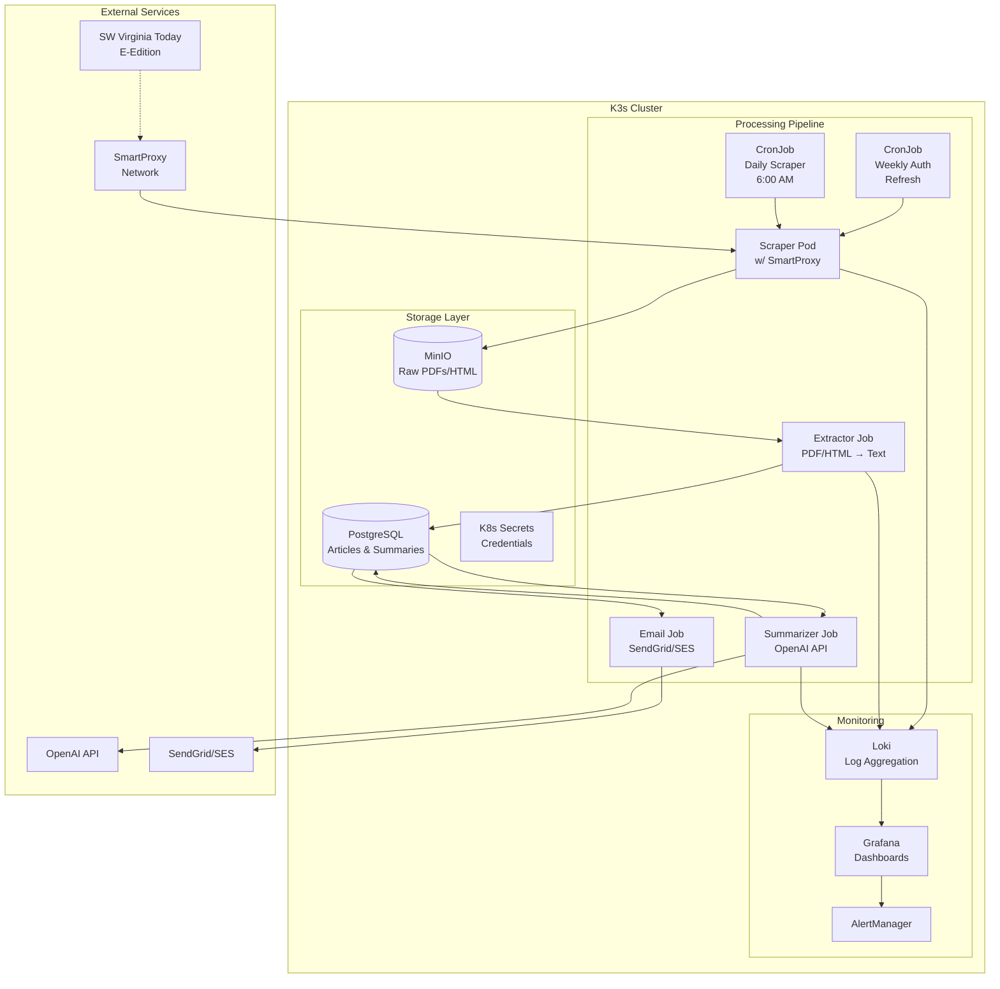

# News Analyzer Architecture Document

## System Overview

The News Analyzer is an automated system that:
1. Authenticates and scrapes Southwest Virginia Today's e-edition daily
2. Extracts articles from PDF/HTML pages
3. Generates AI-powered summaries using OpenAI
4. Delivers a formatted email digest each morning

## Technology Stack

### Core Technologies
- **Language**: Python 3.11
- **Web Automation**: Playwright (with SmartProxy integration)
- **PDF Processing**: pdfminer-six
- **HTML Extraction**: trafilatura
- **AI Summarization**: OpenAI GPT-4
- **Email Service**: SendGrid or Amazon SES
- **Database**: PostgreSQL
- **Object Storage**: MinIO
- **Container Orchestration**: Kubernetes (K3s)
- **Monitoring**: Grafana + Loki + Prometheus

### Proxy Configuration
```python
# SmartProxy Settings (from athena-scraper)
SMARTPROXY_USERNAME = 'spua66m4sy'
SMARTPROXY_PASSWORD = '7h4nhZm69jvME~mslX'
SMARTPROXY_HOST = "us.smartproxy.com"
SMARTPROXY_PORTS = [10001-10010]  # Rotate for reliability
```

## Component Architecture



## Data Flow

### 1. Authentication & Session Management
- **Weekly CronJob** refreshes authentication tokens
- Stores session state in K8s Secret
- Validates auth before each scraping run

### 2. Daily Scraping Pipeline (6:00 AM)
```
1. Load auth state from K8s Secret
2. Connect via SmartProxy (rotate ports)
3. Navigate to e-edition homepage
4. Discover available pages/sections
5. Download PDFs or HTML to MinIO
6. Mark completion in PostgreSQL
```

### 3. Text Extraction
```
1. Monitor MinIO for new content
2. Extract text based on format:
   - PDF: pdfminer-six with layout analysis
   - HTML: trafilatura with metadata preservation
3. Structure articles with metadata:
   - Title, body, section, page number
   - Publication date, URL
4. Store in PostgreSQL with deduplication
```

### 4. AI Summarization
```
1. Batch process new articles
2. Apply prompt template:
   - Focus on local news relevance
   - 200-300 word summaries
   - Preserve key facts and quotes
3. Track token usage and costs
4. Store summaries linked to articles
```

### 5. Email Digest Generation
```
1. Query today's summaries
2. Group by section (Local, Sports, etc.)
3. Generate HTML email:
   - Clean, mobile-friendly design
   - Section headers
   - Article summaries with "Read More" links
   - Daily highlights at top
4. Send via SendGrid/SES at 7:00 AM
```

## Database Schema

```sql
-- Articles table
CREATE TABLE articles (
    id UUID PRIMARY KEY DEFAULT gen_random_uuid(),
    hash VARCHAR(64) UNIQUE NOT NULL,
    source_url TEXT NOT NULL,
    edition_date DATE NOT NULL,
    section VARCHAR(100),
    page_number INTEGER,
    title TEXT NOT NULL,
    body TEXT NOT NULL,
    metadata JSONB,
    created_at TIMESTAMP DEFAULT NOW()
);

-- Summaries table
CREATE TABLE summaries (
    id UUID PRIMARY KEY DEFAULT gen_random_uuid(),
    article_id UUID REFERENCES articles(id),
    summary TEXT NOT NULL,
    bullet_points JSONB,
    tokens_used INTEGER,
    model_version VARCHAR(50),
    created_at TIMESTAMP DEFAULT NOW()
);

-- Processing history
CREATE TABLE processing_log (
    id UUID PRIMARY KEY DEFAULT gen_random_uuid(),
    edition_date DATE NOT NULL,
    stage VARCHAR(50) NOT NULL,
    status VARCHAR(20) NOT NULL,
    details JSONB,
    created_at TIMESTAMP DEFAULT NOW()
);
```

## K8s Resource Specifications

### CronJob: Daily Scraper
```yaml
apiVersion: batch/v1
kind: CronJob
metadata:
  name: news-scraper-daily
spec:
  schedule: "0 6 * * *"  # 6:00 AM daily
  jobTemplate:
    spec:
      template:
        spec:
          containers:
          - name: scraper
            image: harbor.lan/library/news-scraper:latest
            envFrom:
            - secretRef:
                name: news-analyzer-secrets
            resources:
              requests:
                memory: "512Mi"
                cpu: "500m"
              limits:
                memory: "1Gi"
                cpu: "1000m"
```

### Email Service Configuration
```yaml
apiVersion: v1
kind: ConfigMap
metadata:
  name: email-config
data:
  SMTP_HOST: "smtp.sendgrid.net"
  SMTP_PORT: "587"
  FROM_EMAIL: "news-digest@yourdomain.com"
  FROM_NAME: "SW Virginia News Digest"
  RECIPIENT_EMAIL: "your-email@example.com"
  EMAIL_SUBJECT_TEMPLATE: "Your Daily News Digest - {date}"
```

## Security Considerations

1. **Credential Management**
   - All secrets in K8s Secrets
   - No hardcoded credentials
   - Rotate proxy ports for anonymity

2. **Network Security**
   - All traffic through SmartProxy
   - TLS for external APIs
   - Internal service mesh optional

3. **Rate Limiting**
   - Respect site's rate limits
   - Implement exponential backoff
   - Monitor for 429 responses

## Monitoring & Alerts

### Key Metrics
- Scraper success rate
- Articles extracted per day
- OpenAI token usage
- Email delivery status
- Storage utilization

### Alert Conditions
- Scraper fails 3 consecutive days
- Token usage exceeds budget
- Storage > 80% capacity
- Email delivery failures

## Cost Optimization

1. **OpenAI Usage**
   - Cache summaries aggressively
   - Use GPT-3.5 for initial tests
   - Implement token limits

2. **Storage**
   - Retain PDFs for 7 days
   - Compress older content
   - Archive to cold storage

3. **Compute**
   - Use spot instances where possible
   - Scale down during off-hours
   - Optimize container resources

## Disaster Recovery

1. **Backup Strategy**
   - Daily PostgreSQL backups
   - MinIO replication
   - Export summaries to JSON

2. **Recovery Procedures**
   - Automated backup restoration
   - Manual intervention playbooks
   - Monitoring dashboard access

## Future Enhancements

1. **Phase 2 Features**
   - Multi-publication support
   - Keyword alerts
   - Audio briefings (TTS)

2. **Phase 3 Features**
   - RAG chatbot for Q&A
   - Mobile app with push
   - Semantic search

3. **Phase 4 Features**
   - Sentiment analysis
   - Trend detection
   - Community features